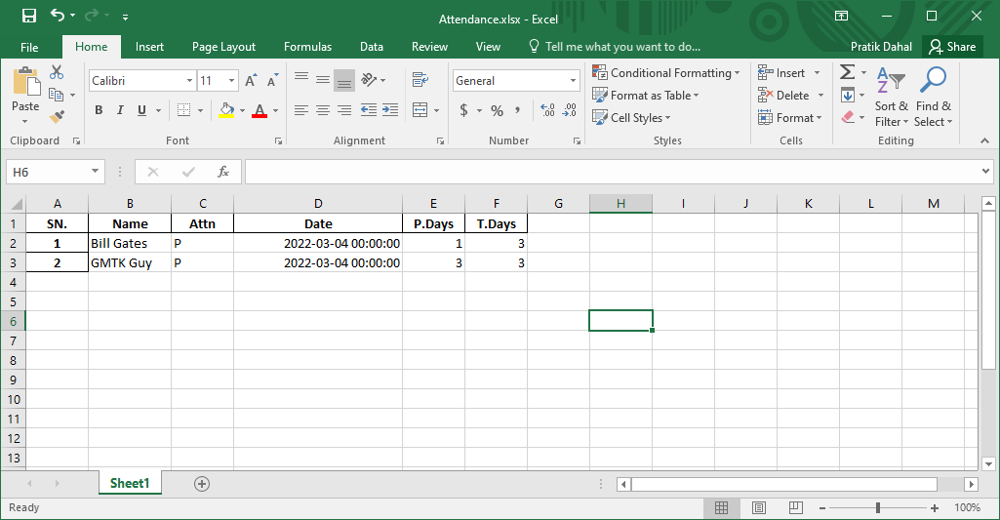

<h4>Project implementation of Facenet.</h4>

<h3>Used this to create an Face recognition attendance.</h3>

Our software will look like below:

 
 
Pressing the Create Button will lead us to Create Page

 
 
Our Project Structure is as belows:

 
 
Our Trainign Sample will be as:

 
 
Our Output will be as:

 
 
 
Be sure to add folders like:
 
aligned_img
 
class
 
train_img

